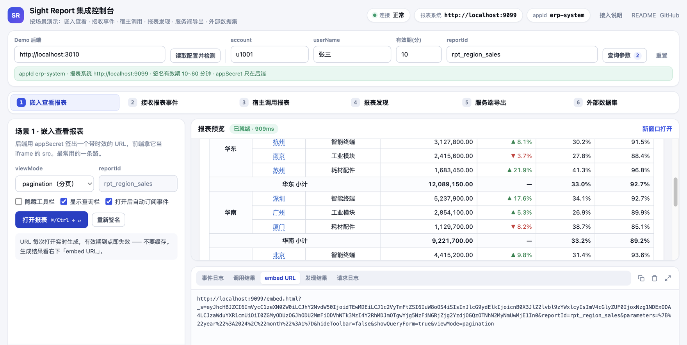
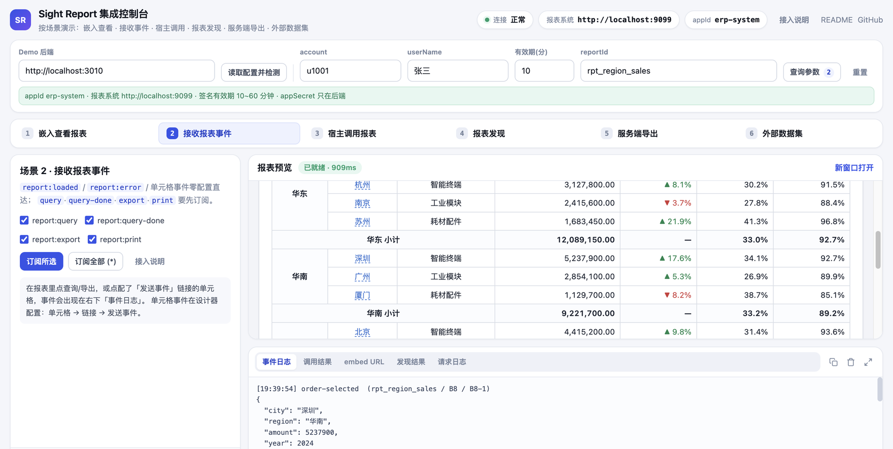
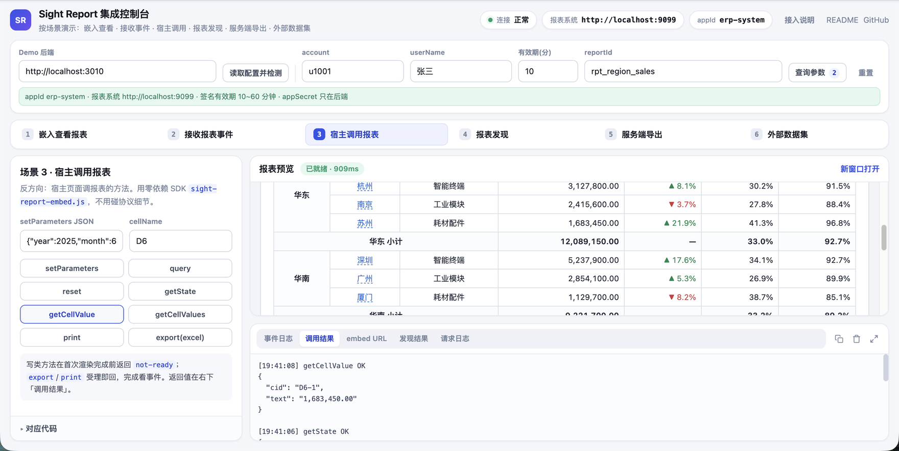
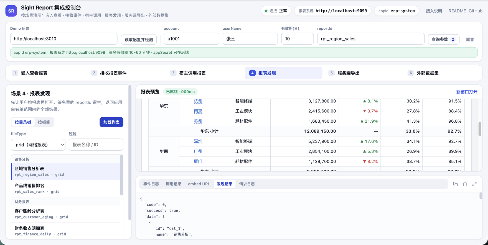
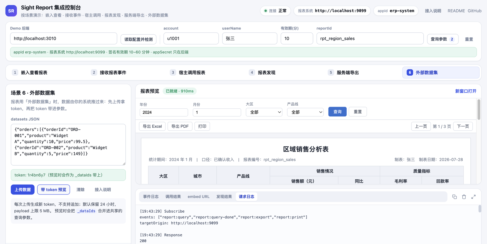
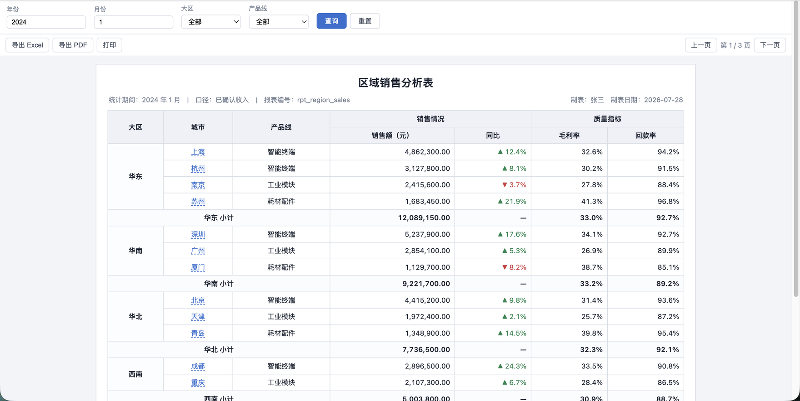

# Sight Report Integration Demo

English · [简体中文](./README.zh-CN.md)

Everything you need to embed **Sight Report** into your own product: a **backend sample**
that keeps `appSecret` server-side and signs requests, a zero-dependency **frontend console**,
and a zero-dependency **host SDK** (`sight-report-embed.js`).

No report-engine source code, no build tooling — `npm install && npm start` and you are running.

```
Your frontend                  Your backend (backend-node here)          Sight Report
─────────────                  ────────────────────────────────          ─────────────
user opens a report  ─────▶     HMAC-SHA256 sign with appSecret
                                build embed URL (no secret inside)
   iframe.src = embedUrl  ◀──── return URL
   ├─ render      ───────────────────────────────────────────────▶  verify + render
   ├─ events      ◀──── postMessage: report:loaded / cell events ───  report page
   └─ invoke      ───── postMessage: invoke setParameters ───────▶
server-side export / staged data ─▶ same signature ───────────────▶  /api/embed/*
```

## Contents

- [Screenshots](#screenshots)
- [Quick start](#quick-start)
- [Repository layout](#repository-layout)
- [Integration guide](#integration-guide)
  - [Signature rules](#signature-rules-shared-by-every-scenario)
  - [Scenario 1: embed a report](#scenario-1-embed-a-report)
  - [Scenario 2: receive report events](#scenario-2-receive-report-events)
  - [Scenario 3: call report methods from the host (SDK)](#scenario-3-call-report-methods-from-the-host-sdk)
  - [Scenario 4: discover reports](#scenario-4-discover-reports)
  - [Scenario 5: server-side export](#scenario-5-server-side-export)
  - [Scenario 6: staged (external) datasets](#scenario-6-staged-external-datasets)
- [Demo backend endpoints](#demo-backend-endpoints)
- [Production checklist](#production-checklist)
- [Troubleshooting](#troubleshooting)
- [License](#license)

## Screenshots

**Scenario 1 · Embed a report** — scenario panel on the left, the embedded report in the middle,
the freshly signed embed URL bottom right:



**Scenario 2 · Receive report events** — clicking a cell with a "send event" link delivers a custom
event and its payload to the host:



**Scenario 3 · Call the report from the host** — `getState` / `getCellValue` through the SDK,
results land in the invoke pane:



<details>
<summary>More: discovery / staged datasets / the report itself</summary>

**Scenario 4 · Discovery**: the report tree is flattened into a clickable list; picking one writes
back to the shared `reportId`, and the raw JSON stays in the discovery pane.



**Scenario 6 · Staged datasets**: upload rows, get a token, preview with it as `_dataIds`.



**The embedded report on its own** (as opened in a new window):



</details>

> About these screenshots: the console, the signing flow, and the event/invoke protocol are all
> **really running**. The report content is **sample data** rendered by a local mock report service —
> no real business data. Point the demo at your own Sight Report deployment and the middle pane
> becomes your report.

## Quick start

**Prerequisites**

1. A reachable Sight Report deployment
2. An application registered in Sight Report (**System → Third-party applications → New**)
   to obtain `appId` and `appSecret` (the secret is shown once — save it)
3. Node.js ≥ 18 (uses the built-in `fetch`)

**Run**

```bash
cd backend-node
cp .env.example .env      # fill in SIGHT_REPORT_BASE_URL / APP_ID / APP_SECRET
npm install
npm start
```

Open <http://localhost:3010/demo/>. The console is **organized by scenario**, mirroring the
integration guide below:

- A **shared context** bar on top: demo backend URL, `account` / `userName`, signature lifetime,
  `reportId`, query parameters. Every scenario uses these values, and they all go into the signature.
- A row of **scenario tabs**, one open at a time: embed → events → host invoke → discovery →
  server-side export → staged datasets. Each one gives you a one-line goal, only the fields that
  scenario needs, its main action, **copyable code rendered from your current form values**, and the result.
- A persistent **report preview** and **inspector** on the right (event log / invoke results /
  embed URL / discovery results / request log). Tabs rather than a sidebar, so the preview keeps
  the width — it still works on a small laptop screen.

First run: click *Read config* on top → pick a report in scenario 4 → open it in scenario 1
(`⌘/Ctrl + ↵`). Scenarios are hash-routed (e.g. `#/events`), so you can share a link to one.

Windows users can double-click `start-demo.cmd`; on macOS/Linux use `./start-demo.sh`.
Docker also works: `cd backend-node && docker compose up --build`.

## Repository layout

```
backend-node/                 backend sample (Express; the only place holding appSecret)
  src/signature-service.js    ★ the signing algorithm — ~40 lines, copy it as-is
  src/report-url-service.js   ★ signed-URL assembly
  src/staged-dataset-service.js staged dataset upload / clear
  src/index.js                demo HTTP endpoints + static hosting
  requests.http               ready-to-run requests (VS Code REST Client)
frontend-static/              frontend console (plain HTML/CSS/JS, no build step)
  sight-report-embed.js       ★ host SDK, zero-dependency UMD, copy into your app
  sight-report-embed.d.ts     SDK type declarations
  index.html / app.js / styles.css
docs/integration-checklist.md handoff / integration checklist
docs/screenshots/             screenshots
```

The three starred files are what you actually move into your project; everything else exists
only to make the demo runnable.

## Integration guide

### Signature rules (shared by every scenario)

Embedding and every `/api/embed/*` call use one signature scheme, passed in the `_s` query parameter.

| Item | Rule |
| --- | --- |
| Sign content | `appId \| account \| userName \| reportId \| expireAt` (joined by `\|`) |
| Algorithm | `HMAC-SHA256(signContent, appSecret)`, lowercase hex output |
| Token body | those fields plus `signature` as JSON, then **Base64Url** encoded (no padding) |
| Placement | query parameter `_s` |
| `expireAt` | Unix seconds. 5–15 minutes for viewing; generate per open, **never cache URLs** |
| `reportId` | bind a concrete id when viewing; usually empty for discovery; **must** match `fileId` for export |

`account` / `userName` identify the currently signed-in user of *your* system. External users are
mapped to internal accounts named `ext__{appId}__{account}`.

**Node.js** (full implementation in `backend-node/src/signature-service.js`)

```js
const crypto = require('crypto')

function buildSignatureToken({ appId, appSecret, account, userName, reportId, expireAt }) {
  const signContent = [appId, account, userName, reportId || '', String(expireAt)].join('|')
  const signature = crypto.createHmac('sha256', appSecret).update(signContent, 'utf8').digest('hex')
  const payload = JSON.stringify({ appId, account, userName, reportId, expireAt, signature })
  return Buffer.from(payload, 'utf8')
    .toString('base64')
    .replace(/\+/g, '-')
    .replace(/\//g, '_')
    .replace(/=+$/g, '')
}
```

**Java**

```java
long expireAt = System.currentTimeMillis() / 1000 + expireMinutes * 60L;
String signContent = String.join("|", appId, account, userName,
        reportId == null ? "" : reportId, String.valueOf(expireAt));

Mac mac = Mac.getInstance("HmacSHA256");
mac.init(new SecretKeySpec(appSecret.getBytes(StandardCharsets.UTF_8), "HmacSHA256"));
StringBuilder hex = new StringBuilder();
for (byte b : mac.doFinal(signContent.getBytes(StandardCharsets.UTF_8))) {
    hex.append(String.format("%02x", b));
}

String payload = String.format(
        "{\"appId\":\"%s\",\"account\":\"%s\",\"userName\":\"%s\","
      + "\"reportId\":\"%s\",\"expireAt\":%d,\"signature\":\"%s\"}",
        appId, account, userName, reportId, expireAt, hex);

String s = Base64.getUrlEncoder().withoutPadding()
        .encodeToString(payload.getBytes(StandardCharsets.UTF_8));
String embedUrl = baseUrl + "/embed.html?reportId=" + reportId + "&_s=" + s;
```

**Python**

```python
import base64, hashlib, hmac, json, time

def build_signature(app_id, app_secret, account, user_name, report_id="", expire_minutes=10):
    expire_at = int(time.time()) + expire_minutes * 60
    sign_content = "|".join([app_id, account, user_name, report_id, str(expire_at)])
    signature = hmac.new(app_secret.encode(), sign_content.encode(), hashlib.sha256).hexdigest()
    payload = json.dumps({
        "appId": app_id, "account": account, "userName": user_name,
        "reportId": report_id, "expireAt": expire_at, "signature": signature,
    }, ensure_ascii=False)
    return base64.urlsafe_b64encode(payload.encode()).rstrip(b"=").decode()
```

> **`appSecret` must stay on the server.** If it reaches the browser, anyone can forge report
> access as any user.

### Two ways to authenticate

Once you have a signature there are two ways to present it — pick one per call site
(`/api/embed/**` ignores the platform login session and accepts only these two):

| Mode | How | Use for |
| --- | --- | --- |
| **A. One-shot signature** (stateless — what this demo uses) | `_s` query parameter on every request | embed URLs, discovery, server-side export. Nothing is stored server-side; it dies with the signature |
| **B. Exchange for a session** | `POST /api/embed/auth` returns a `sessionToken`; send it as the `X-Embed-Session` header | server-side code making several calls in a row, so you sign once; this is what the embed page does internally |

```http
POST /api/embed/auth
{ "signature": "<the _s value>", "reportId": "rpt_sales" }

→ { "code": 0, "data": { "sessionToken": "...", "userId": "...", "userName": "Zhang San",
      "externalAccount": "ext__erp-system__u1001", "appId": "erp-system",
      "reportId": "rpt_sales", "expireAt": 1735660800000 } }
```

- Session lifetime is the smaller of the signature lifetime and the application maximum
  (default 60, max 1440 minutes). Check it with `GET /api/embed/session/validate`,
  end it early with `POST /api/embed/session/logout`.
- Scope still applies in session mode: a signature bound to a `reportId` reaches only that report;
  an unbound one is limited by the application's report allowlist.
- **You do not need to exchange a session to embed a report** — hand the `_s` URL to the iframe
  and the page does it for you.

### Scenario 1: embed a report

```
GET {baseUrl}/embed.html?reportId={reportId}&_s={signature}
```

| Query parameter | Meaning |
| --- | --- |
| `reportId` | report id, required |
| `_s` | signature token |
| `parameters` | report query parameters, JSON-serialized then URL-encoded, e.g. `{"year":2024,"month":1}` |
| `hideToolbar` | `true` hides the toolbar (print / export / paging) |
| `showQueryForm` | `false` hides the query form |
| `viewMode` | `pagination` (default) or `all` |

```js
// Host frontend: the URL comes from your own backend; the browser never signs anything
const embedUrl = await fetch('/my-backend/report-embed-url?reportId=rpt_sales').then((r) => r.text())
document.getElementById('reportFrame').src = embedUrl
// or window.open(embedUrl, '_blank')
```

### Scenario 2: receive report events

The report posts messages to the host with a uniform envelope:

```ts
{ protocol: 'sight-report', name: string, payload: object,
  source: { reportId: string, cellName?: string, cid?: string }, timestamp: number }
```

Two tiers of events:

| Tier | Event | Payload |
| --- | --- | --- |
| Zero-config | `report:loaded` | `{ elapsedMs }` — first render finished, fires once |
| Zero-config | `report:error` | `{ phase: 'load'\|'query'\|'export', message }` |
| Zero-config | custom cell events | link parameters from the designer, evaluated per clicked row |
| Subscribed | `report:query` | `{ parameters }` |
| Subscribed | `report:query-done` | `{ parameters, elapsedMs }` — every render, including the first |
| Subscribed | `report:export` | `{ format }` |
| Subscribed | `report:print` | `{ command }` |
| Subscribed | `report:resize` | report size changed (resize the iframe if you need to) |

**Step 1 — listen (no configuration needed)**

```js
window.addEventListener('message', (event) => {
  if (event.origin !== 'https://your-report-host') return   // verify origin
  if (event.data?.protocol !== 'sight-report') return       // verify protocol namespace
  const { name, payload, source } = event.data
  switch (name) {
    case 'report:loaded':
      console.log('ready in', payload.elapsedMs, 'ms')
      break
    case 'report:error':
      console.error('report error', payload.phase, payload.message)
      break
    case 'order-selected':        // custom cell event name from the designer
      openOrderDetail(payload.orderId)   // source.cid tells you which expanded row
      break
  }
})
```

**Step 2 (optional) — subscribe to process events**

```js
frame.contentWindow.postMessage(
  { protocol: 'sight-report', type: 'subscribe', events: ['report:query', 'report:export'] }, // or ['*']
  'https://your-report-host'
)
```

Subscribing also locks the host origin as the report's `targetOrigin` for later messages.

**Configuring cell events**: report designer → select a cell → Link → Add link → **Send event**.
Event names are yours to choose but must not start with `report:` (reserved). Parameters support
expressions such as `A2` to read the current row's cell value.

### Scenario 3: call report methods from the host (SDK)

The reverse direction uses the same channel: request
`{ protocol:'sight-report', type:'invoke', id, method, args }`, response
`{ ..., type:'invoke-result', id, ok, data|error }`.

Use `frontend-static/sight-report-embed.js` (zero-dependency UMD, ships with `.d.ts`) and you
never touch the protocol directly:

```js
const report = SightReportEmbed.mount('#reportBox', {
  getEmbedUrl: () => fetch('/my-backend/embed-url').then((r) => r.text())
})

await report.ready()                          // loaded event, with a getState poll as fallback
report.on('report:query-done', (e) => console.log(e.payload.elapsedMs))
await report.setParameters({ year: 2025 })    // merge parameters and re-query (awaits completion)
const state = await report.getState()         // parameters / variables / paging / loading
const cell = await report.getCellValue('C4')  // rendered cell text (grid reports)
await report.export('excel')                  // resolves on accept; watch report:export for done
await report.reload()                          // fetch a fresh signed URL and reload
```

With an existing iframe element use `SightReportEmbed.connect(iframeEl)`.

| Method | Notes |
| --- | --- |
| `setParameters(params, { query })` | merges parameters; re-queries unless `query === false` |
| `query()` / `reset()` | re-run query / reset parameters |
| `export(format)` / `print(command)` | resolve on accept; completion arrives as an event |
| `getState()` | parameters, variables, current/total pages, loading flag, active sheet |
| `setSheet(sheetId)` | switch sheet (tab) in multi-sheet reports |
| `getCellValue(name)` / `getCellValues(name)` | rendered cell text (first / all matches) |
| `invoke(method, ...args)` | generic call, so protocol additions need no SDK upgrade |

Write methods return `not-ready` before the first render completes; the SDK subscribes to process
events for you. If your host is a Vue app that can import the report component, the component
channel (`<ReportView ref="reportRef" :file-id="reportId" @report-event="onReportEvent" />`)
needs no subscription and exposes methods through `ref`.

### Scenario 4: discover reports

Let users pick a report first, then open it:

```
GET {baseUrl}/api/embed/report/type-tree?_s={signature}&fileType=grid
GET {baseUrl}/api/embed/report/tag-list?_s={signature}&tag=monthly
```

- `fileType`: `grid` / `document` / `datawall` / `mobile`
- Leave `reportId` **empty** in the signature to get everything the application may access
- With an application report allowlist configured, both endpoints are filtered automatically

### Scenario 5: server-side export

Fetch the file bytes on your server — for downloads, archiving, email, scheduled jobs:

```
GET {baseUrl}/api/embed/export/{pdf|excel|word|csv|ofd}?fileId={reportId}&_s={signature}
```

| Query parameter | Meaning |
| --- | --- |
| `fileId` | report id — **must exactly match `reportId` in the signature** |
| `parameters` | report query parameters (JSON text) |
| `fileName` | optional output file name |
| `pageIndex` | optional, export a single page |
| `sheetId` | optional, pick a sheet in multi-sheet reports |

Use a 5–15 minute lifetime. An empty `reportId` in the signature is rejected by the server.

Large Excel exports run as an async task: `POST /api/embed/export/excel` to create it →
`GET /api/embed/export/excel/task/{taskId}` to poll →
`GET /api/embed/export/excel/download/{taskId}` to download.

> `/api/embed/**` is rate limited: 120 requests per minute per IP, then 429. Throttle bulk exports.

### Scenario 6: staged (external) datasets

When a report uses an *external dataset*, your system pushes the rows instead of the report
querying a database:

1. **Upload** — `POST /api/embed/staged-dataset/set` with `signature` / `reportId` / `datasets`, returns a `token`
2. **Use** — add `"_dataIds": "<token>"` to `parameters` when building the embed URL or exporting
3. **Clear (optional)** — `POST /api/embed/staged-dataset/clear` with `signature` / `token`

```json
POST /api/embed/staged-dataset/set
{
  "signature": "<signature token>",
  "reportId": "rpt_sales",
  "datasets": {
    "orders": [
      { "orderId": "ORD-001", "product": "Widget A", "quantity": 10, "price": 99.5 },
      { "orderId": "ORD-002", "product": "Widget B", "quantity": 5, "price": 149 }
    ]
  }
}

→ { "code": 0, "data": { "token": "a1b2c3d4", "datasetNames": ["orders"] } }
```

- Multiple datasets per request share one token; every `/set` creates a new token — **no appending**
- Data is kept for **24 hours** by default, payload limit **5 MB**
- The report must already define an *external dataset* with its field structure

## Demo backend endpoints

These belong to **this sample backend** (what the console calls), not to the report system's
public contract. Rename them freely in your own project.

| Method | Path | Purpose |
| --- | --- | --- |
| GET | `/health` | liveness |
| GET | `/api/demo/config` | non-secret config + upstream reachability probe |
| POST | `/api/demo/embed-url` | build a signed embed URL |
| GET | `/api/demo/report/type-tree` | proxy the report tree |
| GET | `/api/demo/report/tag-list` | proxy the tag list |
| GET | `/api/demo/export/:format` | proxy export (pdf / excel / word / csv) |
| POST | `/api/demo/staged-dataset/set` | upload staged datasets |
| POST | `/api/demo/staged-dataset/clear` | clear by token |
| POST | `/api/demo/staged-dataset/embed-url` | signed embed URL with `_dataIds` injected |
| GET | `/demo/` | serve the frontend console |

Field-level docs: [`backend-node/README.md`](./backend-node/README.md).
Runnable requests: [`backend-node/requests.http`](./backend-node/requests.http).

## Production checklist

- [ ] `appSecret` exists only server-side — not in any frontend bundle, log, or browser-readable response
- [ ] Embed URLs are generated per open, live 5–15 minutes, and are never persisted or cached
- [ ] The host validates both `event.origin` and `data.protocol` when handling `message`
- [ ] A report allowlist is configured for the application in Sight Report
- [ ] `account` is the real signed-in user, not a hardcoded shared account
- [ ] For exports, the signature `reportId` equals `fileId` and is not empty
- [ ] This demo backend does not go to production — move the signing logic into your own service

Full checklist: [`docs/integration-checklist.md`](./docs/integration-checklist.md).

## Troubleshooting

| Symptom | Check first |
| --- | --- |
| Console header shows *disconnected* | demo backend not started, or wrong backend URL in the form |
| *Backend up, report server unreachable* | wrong `SIGHT_REPORT_BASE_URL`, blocked port, or network segment |
| 401 / 403 when opening a report | `appId`/`appSecret` mismatch, expired signature, `reportId` not allowlisted |
| Page opens but the report is blank | `reportId` does not exist, or the query returned nothing — read `report:error` in the event log |
| Discovery returns empty | `tag` must match exactly, `fileType` must match the report type, allowlist may filter it out |
| Export fails | signature `reportId` differs from `fileId`, or `parameters` is not valid JSON |
| `report:query` never arrives | process events require `subscribe`; only `report:loaded` is zero-config |
| No events at all | the `event.origin` check uses the wrong report host |

## License

MIT — see [LICENSE](./LICENSE). Copy the sample code into your own project freely.
